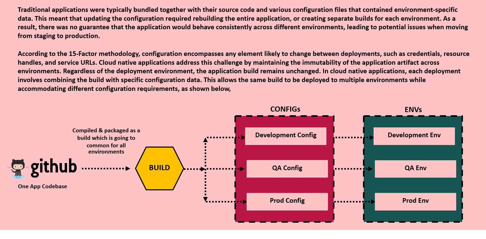
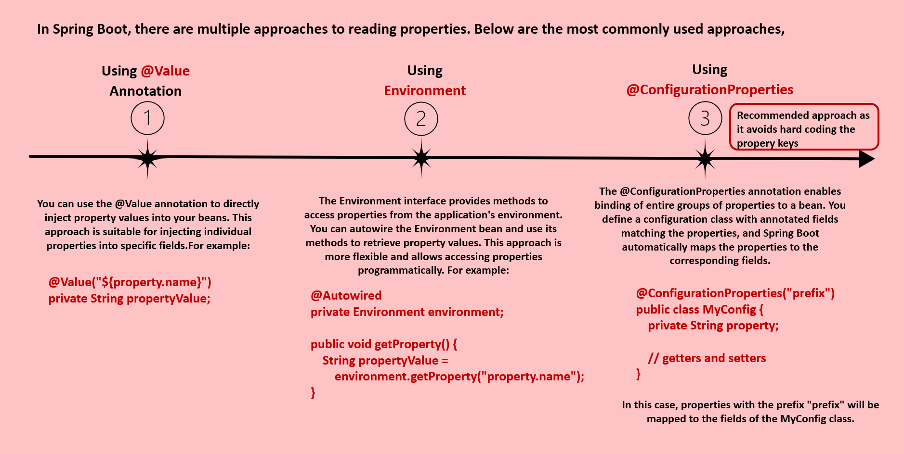
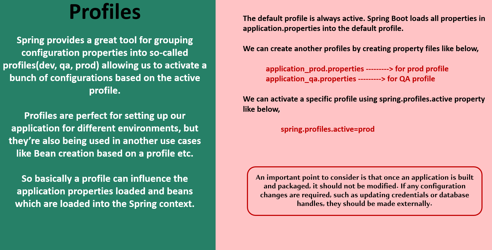

### CONFIGURATION MANAGEMENT IN MICROSERVICES

- #####  Question 1 - Separation of Configs/ Properties: How do we separate the configurations/properties from the microservices so that the same Docker image can be deployed in multiple environments? Because without separating the configurations/properties from microservice business logic, you cannot reuse the same Docker image across multiple environments. If you wrap all your business logic and configurations together, then for each environment, you need to create a separate Docker image along with the relevant configurations/properties. Since it is not recommended approach like generating the same Docker image again and again for each environment, we need to make sure that we are using the same Docker image for all type of environments including the production. With such requirements, how are we going to separate the configurations from the business logic?
- ##### Question 2 - Inject Configs/ Properties: How do we inject configurations/properties that microservice needed during startup of the service? Some sensitive configurations/properties like credentials, we cannot mention them inside any configurations or inside business logic. For such sensitive configurations/properties, we need to make sure that we are injecting them into microservices during the startup of the services.
- ##### Question 3 - Maintain Configs/ Properties: How do we maintain configuration/properties in a centralized repository along with versioning of them? In the similar lines, we need to maintain them in a centralized repository. With hundreds of microservices, it is going to be super complex to maintain all the properties of all microservices manually. That is why we need to maintain all configurations/properties in a centralized repository.

##### There are multiple solutions available in Spring Boot ecosystem to handle these.Below are the solutions:

- ##### 1) Configuring Spring Boot with properties and profiles
- ##### 2) Applying external configuration with Spring Boot
- ##### 3) Implementing a configuration server with Spring Cloud Config Server

#### How Configurations Handled in Traditional Apps & Microservices

#### How Configurations Work in Spring Boot

##### The main problem right now we have is we want to externalize the configurations for our microservices so that the same immutable code artifact can be used across different environments. So to handle these kind of scenarios, we are going to see how to separate the configurations/properties and codebase and also how to externalize the configurations from the codebase.

##### By default, Spring Boot look for the configurations/properties inside application.properties/yml present in the classpath location. But we can have other property files as well and make Spring Boot to read from them.
##### Spring Boot uses a very particular order that is designed to allow sensible overriding of values. Properties are considered in the following order (with values from lower items overriding earlier ones): 

- Properties present inside files like application.properties/yml
- OS Environmental variables
- Java System properties
- JNDI attributes from java:comp/env
- ServletContext init parameters
- ServletConfig init parameters
- Command line arguments

#### How to Read Properties in Spring Boot Apps

##### Option 1 - Using @Value Annotation: Once you mention this, during the startup of the application, Spring Boot is going to look for this property inside all the places like application.properties/yml file, environment variables and command line arguments.
##### Option 2 - Using Environment interface: Many times in real projects, many properties like sensitive information or sensitive credentials, they will be configured with the help of environmental variables. So the server admins, they create these operating system environmental variables during the creation of the server very first time. Or they might have created some scripts which will create the environmental variables during the creation of the server. With this way, any server that is coming inside your microservice network, they will make sure all of them have the same set of environmental variables along with required values. So, to read such environmental variables inside Spring Boot, there is an interface called Environment. It provides many methods to access properties from the application environment where your application is running.
##### Option 3 - Using @ConfigurationProperties: If you have multiple properties, then you need to define multiple Java fields with the help of @Value annotation. So, we should use option1 and option2 only if we have very few properties. But if you have many properties configured for your application, then using the third option is the most recommended approach.

##### We have created an application.yml and we have defined all the properties. But what if I want to have different values for different environments? If my requirement is to maintain different values for different environments, then definitely all these 3 approaches are not going to be helpful. We need something more advanced that is supported by the Spring Boot framework.

#### Spring Boot Profile

##### By following the Spring Boot Profiles, we don't have to rebuild our code and regenerate the Docker image for every environment because we are going to have these properties and configurations related to all the environments inside the code base itself and we can activate these profiles based on our requirements. But if there is a scenario where you cannot maintain certain sensitive credentials or properties inside your properties or yml file, then they should be provided externally during the startup of the application. We will explore what are the various options that we have to provide properties externally during the startup of the application.
##### Suppose if I want to change the value spring.profiles.active to production or suppose if I want to activate a production profile inside the production environment. I need to change this value and I need to regenerate my Docker image. With that, we are not making our code base as immutable. That is why let's try to explore what are the various options that we have in order to change the property values dynamically during the startup through an external parameter.